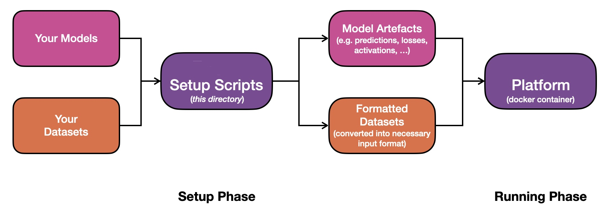

# Backend Take-Home Mini-Project 🦾

We are delighted to enlist your help in building the intelligence that powers the AI revolution! 🛡 🎉 


## Overview

The Platform is designed to ingest a set of datasets, together with artefacts of Deep Learning (DL) models trained on those datasets, and generate _insights_ about the behaviour of these models on the corresponding datasets.

In practice, data and models come in a wide variety of types and representations, which are not necessarily optimised for our processing. Consequently, extracting the metadata necessary for the platform to run requires us to first parse user-provided datasets and models in a _suitable internal representation_.

This process is summarised in the figure below:



Here, user datasets and models are first fed through a set of _Setup Scripts_ during the **Setup Phase**, which extracts the necessary model artefacts, and formats the input datasets appropriately. The Platform then relies on this extracted data, **not** the original data.

**In this exercise, you will be (i) defining such an internal representation, (ii) extracting this representation from input data, and (iii) implementing an SDK for working with this internal representation format.**


## Given

You will be given the following resources (all found in the folder containing these instructions):

1) **Datasets Directory** *./dataset_data*: a directory containing the input datasets to be processed. In this project, we include two datasets: a _human_dataset_, containing images of humans, and a _terminator_dataset_, containing images of terminators. 
   

  
*Example of a Human Dataset image*


  
*Example of a Terminator Dataset image*


2) **Models File** *./model_data.py*: a file containing a definition of a `DummyModel` class, and a function `get_models` for generating a set of such models. **Warning**: Please use this file as-is, without modifying the model definitions.
   

_Note: in reality, DL models are represented as files containing the model architecture and weights (e.g. see [Tensorflow's](https://www.tensorflow.org/guide/saved_model) example here). For simplicity, in this exercise we represent DL models as opaque interfaces implemented using a `DummyModel` class, containing basic methods for retrieving model artefacts (e.g. predictions, activations, etc.) for a given image._


## Task Description

Each dataset is represented by a folder containing two subfolders: (i) _images_, containing the dataset images, and (ii) _annotations_ containing the dataset annotations. 

Both datasets are [object detection](https://en.wikipedia.org/wiki/Object_detection) datasets. Hence, the image annotation information consists of a list of bounding box coordinates, together with the category ids of each bounding box.

Your task is to develop an SDK for saving, and loading of model/dataset artefacts used by the Platform in a _suitably-chosen format_, and writing corresponding code for extracting data in this format from user-provided data. 

## Deliverables

### Summary:

The implemented SDK should have the following functionality:

1) Loading/Saving information about each dataset as a whole, including the following fields: 
   
    1.1) _dataset_name_: Name of the dataset 

    1.2) _dataset_size_: Number of datapoints in the dataset
   
    1.3) _dataset_type_: The image types in the dataset


2) Loading/Saving information about each model as a whole, including the following fields:
    
    2.1) _model_id_: The unique identifier of the model

    2.2) _model_name_: The name of the model

    2.3) _model_datasets_: The datasets the model was trained on


3) Loading/Saving information about each image, including:

    3.1) _image_name_: The name of the image

    3.2) _image_bbox_: The bounding box annotations for the image

    3.3) _image_category_: The corresponding bounding box categories

    3.3) _model_image_bbox_: Bounding box predictions of a model for a given image

    3.4) _model_image_category_: Corresponding predicted bounding box categories of a model for a given image

    3.5) _model_image_heatmap_: Heatmap of a model for a given image

   3.6) _model_image_activations_: Activations of a model for a given image from specified layers

The implemented code should include the above SDK, as well as extraction code for extracting/converting input data/model information into a format used by the SDK.

Your submission must include examples of how to use *all* of the SDK calls.


### Requirements:

The high-level SDK calls for loading/saving/extracting the above data should be implemented in Python.

You can use any other resources for the low-level storage and representation of data (e.g. using [SQL](https://en.wikipedia.org/wiki/SQL), or [MongoDB](https://www.mongodb.com/)).


## Evaluation Criteria 

This exercise primarily assesses your backend software design and architecture skills.

In particular, we will be assessing the following:

1. Functionality: Does the SDK get the job done? 
2. Code quality: see below
3. Design thinking: What architectural design decisions and trade-offs were made and how are they justified (see below for more info)?

**Code Quality**:
1) Does the code allow to perform all actions specified in the deliverables?
2) Is the code readable, maintainable, efficient, and reusable? 
3) Does the code have a consistent style?
3) Is the code documented?
4) Is the code light-weight tested?


**Software Architecture/Design**:
1) Is the current implementation robust to variations in the input? e.g.: can it handle arbitrary image folder structures? 

2) Is the current implementation space-efficient? e.g.: will it scale to thousands, or even millions of images?

3) Is the current implementation time-efficient? e.g.: will retrieval speed be low, even for thousands, or millions of images?

4) Is the current implementation easily extendable? e.g.: how easy is it to add more metadata extraction to the images? 

5) Are the SDK call definitions clear, understandable, and extendable?


### Basic Example

Below is a barebones example of a possible submission, with a follow-up analysis of its quality:

**Important**: the below snippet gives an example for demonstraing **one** SDK call. We expect a full submission to have similar examples for **all** SDK calls specified above.

```python
import os
import json

from model_data import get_models


###############################################################################################
#                                       SDK Functions 
###############################################################################################
def preprocess_data(dataset_data_dir, dummy_models):
   print("Performing no pre-processing at all...")


def load_img_bbox(img_path, img_dir, annotations_dir):
   # Get relative image path
   rel_img_path = os.path.relpath(img_path, img_dir)
   # Compute the path to the annotations directory
   annotations_img_path = os.path.abspath(os.path.join(annotations_dir, rel_img_path))
   annotations_img_path = os.path.splitext(annotations_img_path)[0] + ".json"
   # Load the annotations data
   with open(annotations_img_path, "r") as annotations_file:
      img_data = json.load(annotations_file)
   # Retrieve the bounding box data
   bbox_data = img_data['bbox']
   return bbox_data


################################################################################################

def main():
   # Specify path to the image datasets
   dataset_data_dir = "dataset_data"

   # Load the DL models
   dummy_models = get_models()

   # Run pre-processing extraction
   preprocess_data(dataset_data_dir, dummy_models)

   # Demonstrate SDK call for loading image metadata
   img_path = "dataset_data/human_dataset/images/11.jpg"
   img_dir = "dataset_data/human_dataset/images/"
   annotations_dir = "dataset_data/human_dataset/annotations/"
   img_bbox = load_img_bbox(img_path, img_dir, annotations_dir)
   print(f"SDK call for image {img_path} is: ")
   print(f"{img_bbox} ...")

```

This submission:

1. Contains an initial pre-processing step, which is called before using the SDK ✅

2. Contains an example SDK call of image bounding box data loading, which successfully loads bounding box data for the image ✅

However, here are just a few examples of where it could be improved:

1. The pre-processing step does not change the provided data at all. Hence, the internal representation is completely non-optimized, and very inefficient (reading from individual json files). ❌

2. The SDK function call requires 3 separete arguments for the image path, annotations directory, and images directory, which is a little clunky. ❌

3. The SDK function call is now reliant on the user's representation of the format (i.e. if the user changes the way annotations are represented, the core SDK code will have to be re-written). An explicit setup phase, converting the user data representation format into an internal one, would have de-coupled this dependency. ❌

Overall: This is an example of a barebones submission which, whilst technically giving an example of an SDK, would be considered of very low quality.

