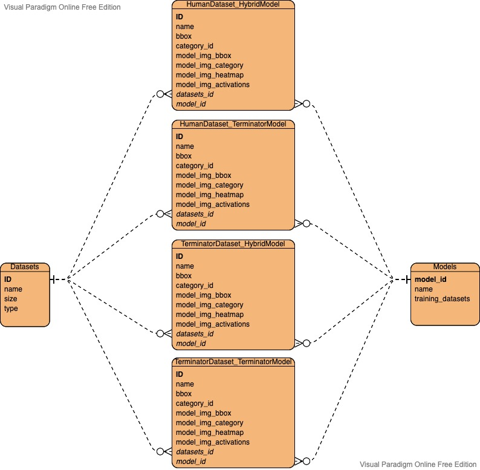

# Backend Python Mini-Project 🦾

### Comments: 
1. Pytest was misbehaving because, apparently, it doesn't like __ init __.py files in the root directory. 
Removing it solved the problem, however for bigger projects folder structure should be cautiously considered.
2. Reader.py - All arrays are stored in the DB as strings in SQLite. Ideally, different database technology should be used,
one with native data type "array". Note: SQLite was chosen due to time constraints - the project had to be done in 3 days, 
which didn't leave much room for investigation on new DB technologies.

### How to run
By running SDK.py it will extract and process all data, and save it into the DB. Also it will retrieve samples from the 
DB for image, model and dataset.  
After the first run line 13 "Processor.add_data_to_db(db_dir, datasets_dir)" should be excluded/commented, since the 
data is already in the DB.

## Overview
The overall design is inteded to split the code into four logical parts (ETL + testing):

1. Extract: A loader /Load.py/ to extract information about images/annotations from the file system.

2. Transform:
   1. A processor /Processor.py/ to generate the internal representation for datasets, models and images.
   The processor is constructed to load all dataset data in bulk. 
   2. DataObjects.py defines the internal representation which should be used for processing and reading/writing from the DB.

3. Load:
   1. Writer.py - handles the creation of tables and data insertion in the DB
   2. Reader.py - handles the read and return of information from the DB to the internal representation defined in DataObjects.py
   3. datasets.db - SQLite database

4. Test.py contains some lightweight tests. Pytest is misbehaving and will be debugged at the end.

For the DB the idea is to use horizontal partitioning for each combination of dataset and model, in order to maintain the performance at scale. 
Each new dataset processed with any given model or old dataset processed with new model will be recorded in
new separate table. Further vertical segmentation could be utilized, if image columns are not always requested in bulk.

